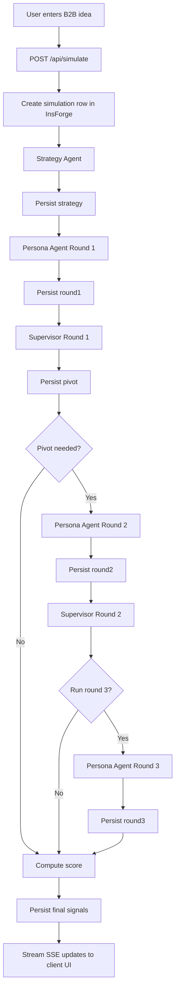

# ExecuSim

ExecuSim is an AI-assisted B2B idea validation workspace. It takes a rough startup idea, turns it into a sharper market hypothesis, runs that hypothesis through staged buyer simulations, lets an executive supervisor decide whether to pivot, and finishes with a weighted validation score that explains what to test next.

## Copy-Ready Project Description

Use this anywhere a "Project Description" field is asking for a strong summary:

```md
ExecuSim is a market-validation simulator for B2B startups. Instead of relying on vague brainstorming or hidden prompt chains, it turns a startup idea into a visible decision loop: strategy formation, buyer pushback, supervisor-led pivots, and a weighted validation score. The system simulates how early-stage, growth-stage, and mid-market buyers react to pricing, messaging, trust, workflow, and procurement friction so founders can refine their wedge before spending time on outreach, demos, or product work.
```

## What It Does

- Accepts a one-sentence B2B startup idea.
- Uses a strategy agent to define ICP, pricing, messaging, and the core business hypothesis.
- Generates three realistic buyer profiles across distinct market stages.
- Simulates buyer objections, willingness to pay, trust level, and procurement intensity.
- Uses an executive supervisor to decide whether the idea should pivot.
- Optionally runs a second and third buyer round when the signal is improving but unresolved.
- Computes final market signals for readiness, GTM clarity, and upside.
- Persists every stage of the run to InsForge.
- Streams progress live to the UI through Server-Sent Events.

## Product Positioning

ExecuSim is not trying to replace customer interviews.

It is designed to compress the first pass of B2B validation so a founder, operator, or product lead can answer better questions earlier:

- Is the ICP too broad?
- Is the pricing mismatched to the buyer?
- Are the blockers about trust, workflow, ROI, or procurement?
- Did the revised pitch actually improve the signal?
- Should this move to real discovery, or should it pivot first?

## Demo Narrative

The best showcase path in the current app is:

- Idea: `AI compliance automation tool for fintech`
- Mode: `/simulate?demo=1`

That demo is pre-seeded in [lib/demo-fixture.ts](./lib/demo-fixture.ts) and walks through:

1. Initial strategy framing
2. Round 1 buyer pushback
3. A trust-focused supervisor pivot
4. Round 2 improved buyer responses
5. A workflow / proof-packaging pivot
6. Round 3 resolution
7. Final score output

## Architecture Map



## Runtime Flow

The main orchestration lives in [app/api/simulate/route.ts](./app/api/simulate/route.ts).

### 1. Simulation record is created

The route creates a row in the `simulations` table with:

- `idea`
- `status = running`

### 2. Strategy agent shapes the wedge

The strategy agent in [lib/agents/strategyAgent.ts](./lib/agents/strategyAgent.ts) asks MiniMax to output:

- `icp`
- `pricing`
- `messaging`
- `hypothesis`

This gets written back to InsForge as `strategy`.

### 3. Persona agent simulates buyers

The persona system in [lib/agents/personaAgent.ts](./lib/agents/personaAgent.ts):

- picks an evidence pack based on the idea and strategy
- generates 3 buyer profiles
- evaluates the strategy from each buyer's perspective
- normalizes the output into strict structured data

The three buyer stages are:

- `stage_early`
- `stage_growth`
- `stage_mid_market`

Each persona response includes:

- evaluation summary
- interest score
- objections with category / severity / blocking flag
- likelihood
- willingness to pay
- trust signal
- procurement intensity

### 4. Supervisor decides whether to pivot

The supervisor in [lib/agents/supervisorAgent.ts](./lib/agents/supervisorAgent.ts) looks at structured buyer signals, not just narrative prose.

It decides:

- whether to pivot
- what kind of pivot is needed
- which segment is most at risk
- whether round 3 is justified

Possible pivot types:

- `pricing`
- `messaging`
- `icp`
- `trust`
- `workflow`
- `both`
- `none`

### 5. Scoring converts reactions into a visible signal

The score engine in [lib/scoring.ts](./lib/scoring.ts) computes:

- `validation_score`
- `adoption_rate`
- `buyer_readiness_score`
- `gtm_clarity_score`
- `venture_upside_signal`
- `failure_reason`
- `score_summary`

Buyer stages are weighted differently:

- early-stage: `1.0`
- growth-stage: `1.2`
- mid-market: `1.5`

That means harder buyers matter more than easy ones.

## Decision Loop Map

```text
idea
  -> strategy
  -> round 1 buyers
  -> supervisor decision
  -> revised strategy
  -> round 2 buyers
  -> supervisor decision
  -> optional round 3
  -> weighted score
  -> refine / proceed / pivot
```

## Data Persistence

InsForge is used as the persistence layer for run history and intermediate state.

Current write pattern:

- insert row when the simulation starts
- update with `strategy`
- update with `round1`
- update with `pivot`
- update with `round2`
- update with `pivot2`
- update with `round3`
- update with final score fields and completion state

Important implementation detail:

The supervisor does not re-query previous rounds from InsForge during the same request. The API route passes earlier outputs forward in memory, and InsForge stores them as durable run history.

## Simulation Record Shape

The primary TypeScript model is defined in [lib/types.ts](./lib/types.ts).

Key fields on a simulation:

- `id`
- `idea`
- `status`
- `strategy`
- `round1`
- `pivot`
- `round2`
- `pivot2`
- `round3`
- `validation_score`
- `adoption_rate`
- `buyer_readiness_score`
- `gtm_clarity_score`
- `venture_upside_signal`
- `score_summary`
- `rounds_completed`
- `failure_reason`
- `created_at`
- `updated_at`

## Evidence Packs

Evidence packs live in [lib/evidence-packs.ts](./lib/evidence-packs.ts). They help the buyer simulation feel domain-aware instead of generic.

Current domains include:

- fintech
- legal
- hr
- sales
- compliance
- design ops

Each pack provides:

- buyer language examples
- common objections
- ROI language
- procurement expectations
- typical budgets by stage
- required integrations
- trust expectations
- adoption blockers

If no strong keyword match is found, the app falls back to the default pack.

## Frontend Surface

### Landing page

[app/page.tsx](./app/page.tsx) explains the concept and introduces the simulation loop:

- strategy
- buyer reactions
- supervisor pivoting
- score output

### Simulation page

[app/simulate/page.tsx](./app/simulate/page.tsx) is the main product UI. It provides:

- idea intake
- live or demo mode
- streamed status updates
- staged panels for strategy, buyers, supervisor, and score
- side progress rail

The UI consumes SSE events from the API route:

- `start`
- `strategy`
- `round_personas`
- `supervisor`
- `score`
- `error`
- `done`

## Core Components

UI components live in [components](./components).

- [components/AgentNetwork.tsx](./components/AgentNetwork.tsx): hero visualization
- [components/DashboardPanel.tsx](./components/DashboardPanel.tsx): animated panel shell
- [components/StrategyDisplay.tsx](./components/StrategyDisplay.tsx): structured strategy output
- [components/PersonaGrid.tsx](./components/PersonaGrid.tsx): buyer response layout
- [components/SupervisorDisplay.tsx](./components/SupervisorDisplay.tsx): pivot reasoning view
- [components/ScoreDisplay.tsx](./components/ScoreDisplay.tsx): final signal output
- [components/StatusBadge.tsx](./components/StatusBadge.tsx): run state indicator
- [components/Navbar.tsx](./components/Navbar.tsx): page navigation

## LLM Layer

MiniMax integration lives in [lib/minimax.ts](./lib/minimax.ts).

It handles:

- request formatting
- auth with `MINIMAX_API_KEY`
- response extraction
- sanitization of malformed JSON-like model output
- parsing fenced or noisy JSON into strict objects

This is what keeps the app resilient when the model wraps output in markdown or returns slightly messy JSON.

## Environment Variables

Use [.env.example](./.env.example) as the base:

```env
NEXT_PUBLIC_INSFORGE_URL=https://your-project.region.insforge.app
NEXT_PUBLIC_INSFORGE_ANON_KEY=your-insforge-anon-key
INSFORGE_API_KEY=your-server-side-insforge-api-key
MINIMAX_API_KEY=your-minimax-api-key
MINIMAX_TIMEOUT_MS=45000
```

### What each variable does

- `NEXT_PUBLIC_INSFORGE_URL`: InsForge backend URL
- `NEXT_PUBLIC_INSFORGE_ANON_KEY`: InsForge anonymous client key
- `INSFORGE_API_KEY`: server-only InsForge API key for privileged writes from API routes; if omitted, the server falls back to the anonymous key
- `MINIMAX_API_KEY`: key for the MiniMax chat completion API
- `MINIMAX_TIMEOUT_MS`: optional per-request timeout for MiniMax calls; defaults to `45000`

## Local Development

### Install

```bash
npm install
```

### Run locally

```bash
npm run dev
```

Then open:

- `http://localhost:3000/`
- `http://localhost:3000/simulate`
- `http://localhost:3000/simulate?demo=1`

## Build and Quality Checks

### Build

```bash
npm run build
```

### Lint

```bash
npx eslint .
```

### Test

```bash
npm test
```

## Test Coverage Map

The current test suite covers both UI and runtime behavior from [__tests__](./__tests__):

- [__tests__/simulate-api.test.ts](./__tests__/simulate-api.test.ts): API route / integration boundaries
- [__tests__/simulate-page.test.tsx](./__tests__/simulate-page.test.tsx): simulation page behavior
- [__tests__/strategyAgent.test.ts](./__tests__/strategyAgent.test.ts): strategy agent contract
- [__tests__/parseLLMJson.test.ts](./__tests__/parseLLMJson.test.ts): JSON parsing robustness
- component tests for dashboard, navbar, badges, agent cards, and displays

## Deployment

Deployment notes live in [VERCEL_DEPLOY.md](./VERCEL_DEPLOY.md).

High-level deployment rules:

- deploy the repository root
- use the `Next.js` framework preset
- provide all three required env vars
- keep the API route on Node.js
- allow enough execution time for multi-step LLM orchestration

## Repository Map

```text
app/
  api/simulate/route.ts      SSE orchestration and persistence
  simulate/page.tsx          Main simulation UI
  page.tsx                   Landing page
  globals.css                Shared visual system

components/
  AgentNetwork.tsx
  DashboardPanel.tsx
  Navbar.tsx
  PersonaGrid.tsx
  ScoreDisplay.tsx
  StatusBadge.tsx
  StrategyDisplay.tsx
  SupervisorDisplay.tsx

lib/
  agents/
    strategyAgent.ts         Strategy generation
    personaAgent.ts          Buyer generation and evaluation
    supervisorAgent.ts       Pivot decisions
  demo-fixture.ts            Demo-mode event stream
  evidence-packs.ts          Domain grounding inputs
  insforge.ts                Shared InsForge client helper
  minimax.ts                 LLM and JSON parsing utilities
  scoring.ts                 Weighted scoring engine
  types.ts                   Shared data contracts

__tests__/
  simulate-api.test.ts
  simulate-page.test.tsx
  strategyAgent.test.ts
  parseLLMJson.test.ts
  ...
```

## Current Product Truth

What the app is today:

- a visible AI market-simulation product for B2B ideas
- optimized for pre-sales clarity and wedge refinement
- strongest when the idea is specific, B2B, and tied to real buyer friction

What the app is not today:

- a CRM
- a production analytics suite
- a replacement for customer discovery interviews
- a generic consumer-idea evaluator

## Suggested Next Improvements

- add a dedicated history page backed by the `simulations` table
- make prior run comparison first-class in the UI
- expose score deltas between rounds visually
- add more evidence packs for new verticals
- store richer supervisor telemetry for later analysis
- support authenticated multi-user workspaces

## One-Sentence Summary

ExecuSim turns a rough B2B startup idea into a visible market-validation loop with staged buyers, supervisor pivots, persisted run history, and a weighted signal for what to do next.
